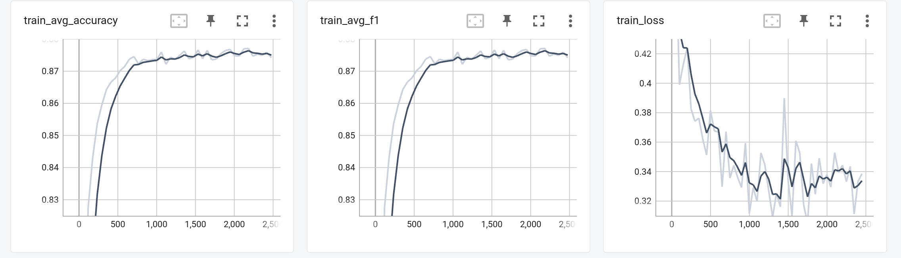
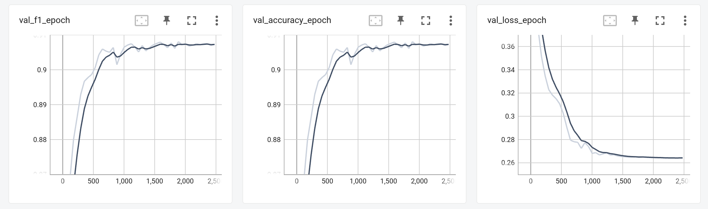

# Blink Classification

Repo with model training and evaluation code for blink classification


### Getting Started

To download project:
```
git clone https://github.com/Vadbeg/blink_classification.git
```


### Installing
To install all libraries you need, print in `blink_classification` directory:

```
 pip install -r requirements.txt
```

It will install all essential libraries


## Data

You can download training data [here](http://mrl.cs.vsb.cz/eyedataset).
Image examples:


## Model

Simple model was used with 3 conv layers. And 4170 params in total. So, it is extra small (0.02 MB)
and fast (450 it/s on GTX 1080ti).

## Config

To use project you need to create config. Example can be found here:

[train_config.yaml](configs/train_config.yaml)


## Scripts


#### train.py

Is used for training (wow). Almost all pipeline params can be changed from config.

```
python train.py --config configs/train_config.yaml
```

#### inference.py

```
python inference.py --folder-path "/home/vadbeg/Downloads/train/train"
```


## Pipeline

Dataset was downloaded from this [URL](http://mrl.cs.vsb.cz/eyedataset). It was collected only from 37 people.
Images from train and test datasets were pretty similar, but
not entirely. So, augmentations were essential for solving this task.

Pytorch-Lightning was used as a wrapper over PyTorch, because of its flexibility and loggers support. I've used
TensorBoard for logging. Metrics:




After training I've manually checked result on test dataset. And
it is not ideal. It can be so, because I've split dataset on train/val randomly, but not by people. So making this
could boost solution.

Also the best way to make better solution with this task is better data. First we can manually check training data,
and try to fix errors in it. Next we can use
[pseudo-labeling](https://towardsdatascience.com/pseudo-labeling-to-deal-with-small-datasets-what-why-how-fd6f903213af).
And after also manually check predictions.

Of course bigger models could help us. But even with such simple model
we reached 0.93 f1-score on val dataset.

And we can use more classical CV approaches to this task. For example
[here](https://github.com/Vadbeg/human_pose_estimation/blob/master/modules/models/blink_detector.py)
I've used imutils and calculated eyes aspect ratio for blink detection. It worked pretty well.

## Built With

* [PyTorch](https://pytorch.org) - The NNs framework used
* [Albumentations](https://albumentations.ai) - The augmentation framework used
* [pytorch-lightning](https://www.pytorchlightning.ai) - Train loop framework used

## Authors

* **Vadim Titko** aka *Vadbeg* -
[LinkedIn](https://www.linkedin.com/in/vadtitko/) |
[GitHub](https://github.com/Vadbeg/PythonHomework/commits?author=Vadbeg)
